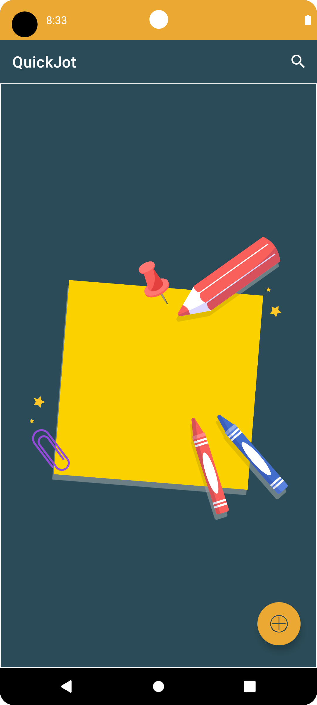
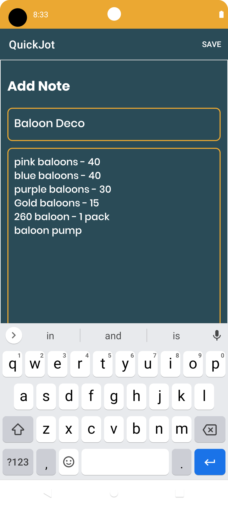
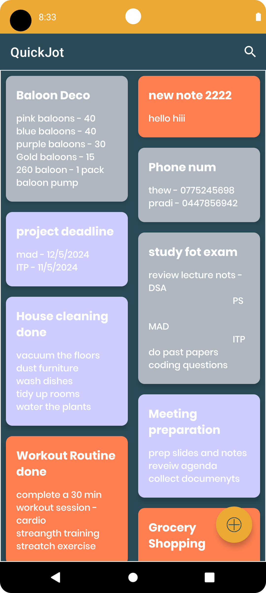
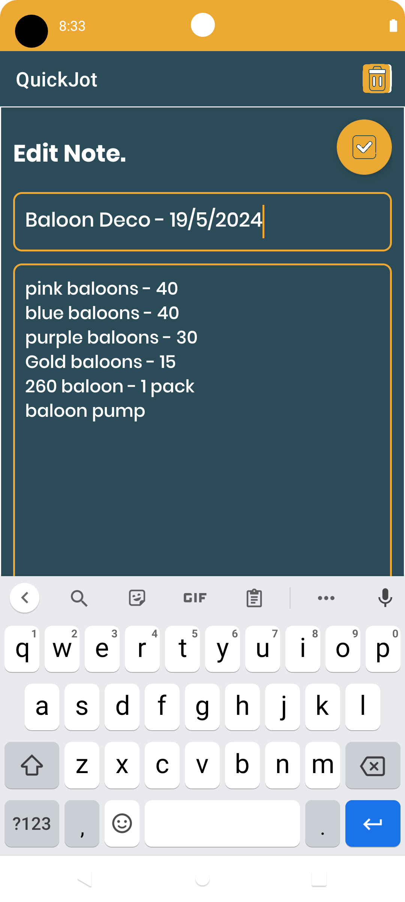
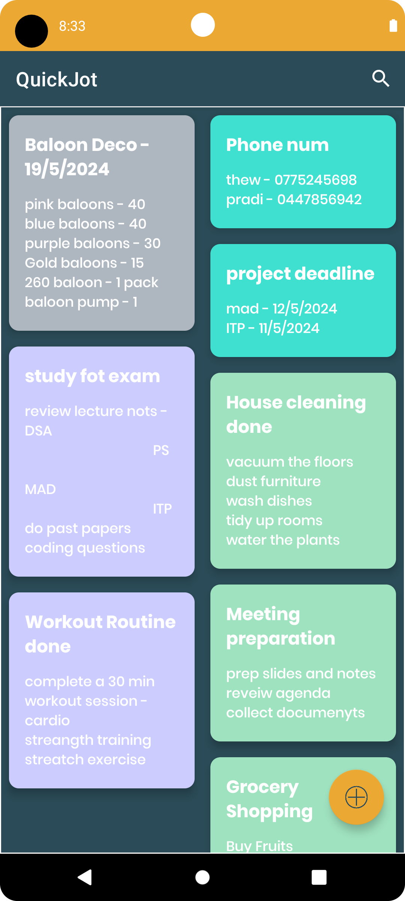
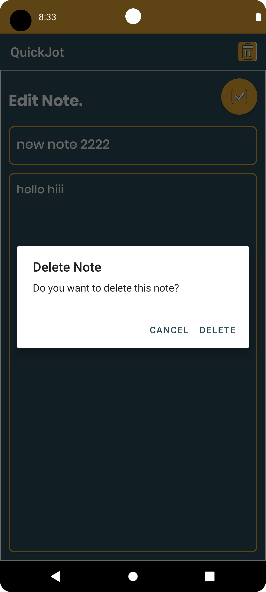
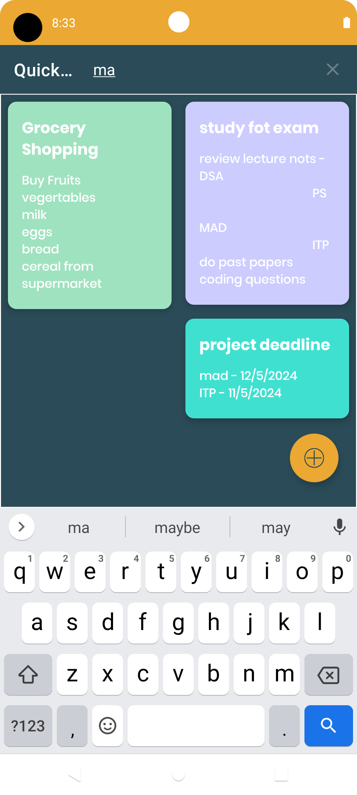

<p align="center">
    <a>
    
    </a>
    <h1 align="center">QuickJot App</h1>
</p>

## About
QuickJot is a versatile note-taking application designed to streamline your daily tasks and enhance productivity. With its intuitive interface and robust features, QuickJot allows users to capture thoughts, ideas, and to-do lists all in one convenient platform.

## Features:
Fast note creation <br>
Flexible and attractive organization <br>
Seamless Synchronization


## Screenshots of app UI

<div style="display:flex;">
  <p align="center">




    </p>

</div>
<br>
<div style="display:flex;">
  <p align="center">



    </p>
</div>

## 🚀 Getting Started

### Prerequisites
*   Android Studio 
*   Java JDK

## 📃 Libraries used
- [Kotlin](https://kotlinlang.org/) - First class and official programming language for Android development.
- [Coroutines](https://kotlinlang.org/docs/reference/coroutines-overview.html) - For asynchronous and more..
- [Room](https://developer.android.com/topic/libraries/architecture/room) - SQLite object mapping library.
- [RecyclerView](https://developer.android.com/jetpack/androidx/releases/recyclerview) - Display large sets of data in your UI while minimizing memory usage.
- [Material Components for Android](https://github.com/material-components/material-components-android) - Modular and customizable Material Design UI components for Android.
- [ViewBinding](https://developer.android.com/topic/libraries/view-binding) - Generates a binding class for each XML layout file present in that module and allows you to more easily write code that interacts with views.

## 🔨 Build and Run Application

Follow this steps to get Working Project!
```
1. Clone this repository or download file
2. Extract zip if downloaded code
3. Open project in Android Studio
4. Wait while Android Studio Download gradle or required files
5. Hit Run Button !
```


